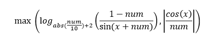

# Задание для предмета "Алгоритмизация и программирование"
___________

Целью работы было написание программы на любом языке программирования с выполнением условий задачи.

Задача: 

На языке программирования создать программу, которая будет просить у пользователя ввести начальные и конечные значения для диапазона расчета X, шаг изменения переменной deltaX. 

Программа должна вывести на экран таблицу (которая корректно выводит значения для разного набора исходных данных – столбцы «не едут», правая граница таблицы постоянна) с номером строки, значению X, значению полученного выражения. В случае невозможности вычисления выражения для конкретного случая X, num (деление на ноль, логарифм из отрицательного числа, значение синуса или косинуса равно 0), в строке таблицы необходимо вывести сообщение об ошибке.

В программе должны быть введены две функции пользователя, которые возвращают значения для сравнения в функции min или max.

Для четных номеров:
